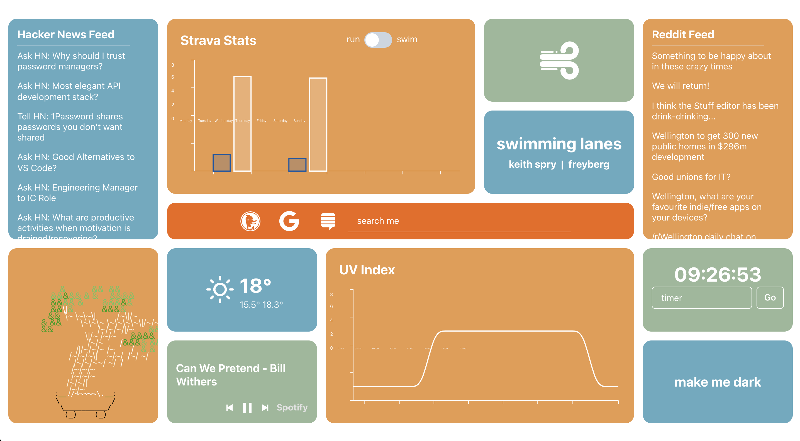

# [StartPage](https://startpage.allistergrange.com/)

I've wanted a custom 'New Tab' page for quite some time now, so I figured I'd build one over the Christmas period. It uses about 5 APIs to pull down info on things that I regularly search for every day. I would love to integrate this with an Apple Watch to give my live heart rate and more metrics, but it seems that that's limited by the Apple API at the moment.

<p align="center">
  
</p>

## APIs Used

- [Niwa](https://developer.niwa.co.nz/) for the UV Index data (which is a local New Zealand Government run weather station)
- [Strava API](https://developers.strava.com/docs/reference/) for my swims/runs for the week
- [Weather API](https://www.weatherapi.com/) for the weather data for my city
- [Hacker News](https://hackernews.api-docs.io/) for the top ask posts for the day

## How to Make This Your Own New Tab Page

Fork the repo, clone it down and create a .env.local file in the root directory and populate the following keys:

```
NIWA_API_KEY=<YOUR_KEY_HERE>
NIWA_API_SECRET=<YOUR_KEY_HERE>
NIWA_API_URL=https://api.niwa.co.nz/uv/data
STRAVA_CLIENT=<YOUR_KEY_HERE>
STRAVA_SECRET=<YOUR_KEY_HERE>
STRAVA_REFRESH_TOKEN=<YOUR_KEY_HERE>
WEATHERAPI_TOKEN=<YOUR_KEY_HERE>
```

Get the keys from the links above in the "APIs Used" section.

Hosting the website is very easy with [Vercel](https://vercel.com), go check them out.

I use [this](https://chrome.google.com/webstore/detail/custom-new-tab-url/mmjbdbjnoablegbkcklggeknkfcjkjia?hl=en) extension to make that start page open up on every new tab of mine.

## Tech

Written in NextJS with CharkaUI. Hosted in Vercel.

## Potential Tiles

- Quick links to your favorite websites
- Have the website control your spotify
- A running todo list that you could interact with? (google keep api is only for enterprise :( )
- Heart rate (pulled from a smart watch through a phone)
- Live location (same as above)
- Background is animated (boids?)
- Quote of the day or a photo that changes each day?
- Emails?
- Have some art pulled from an API?
