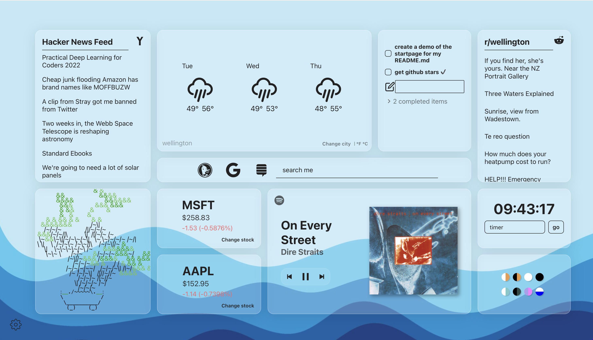

# [StartPage](https://startpage.allistergrange.com/)

<p align="center">
  
</p>

## Inspiration

Do you want to have a dashboard with all of the information (addictions) you'd want to see handy in one spot on every new tab? I do, so I am building it!

I use [this](https://chrome.google.com/webstore/detail/custom-new-tab-url/mmjbdbjnoablegbkcklggeknkfcjkjia?hl=en) extension to make that start page open up on every new tab of mine.

## Tech

Local storage is used for storing your information, meaning you own your data! All of the settings, tokens and themes sit on your own browser. Some may call it laziness that I don't want to maintain a database, others may see it as me helping prevent your data being in yet another cloud service. 

Written in NextJS with CharkaUI. Hosted in Vercel.

## Current API Integrations

- [Strava API](https://developers.strava.com/docs/reference/) for my swims/runs for the week
- [Spotify API](https://developer.spotify.com/documentation/web-api/) for Spotify controls and your favorite artists
- [Weather API](https://www.weatherapi.com/) for the weather data for my city
- [Hacker News](https://hackernews.api-docs.io/) for the top ask posts for the day
- [Stocks API](https://finnhub.io/docs/api) for the stick ticker info

## Future API Integrations

- Twitter
- Outlook / Microsoft
- Gmail
- Public transport provider

## Local Hosting

Fork the repo, clone it down and create a .env.local file in the root directory and populate the following keys:

.env.local
```
STRAVA_CLIENT_ID=<YOUR_SECRET_HERE>
STRAVA_SECRET=<YOUR_SECRET_HERE>
WEATHERAPI_TOKEN=<YOUR_SECRET_HERE>
SPOTIFY_CLIENT_ID=<YOUR_SECRET_HERE>
SPOTIFY_CLIENT_SECRET=<YOUR_SECRET_HERE>
FINNHUB_SECRET=<YOUR_SECRET_HERE>
TWITTER_SECRET=<YOUR_SECRET_HERE>
TWITTER_API_KEY=<YOUR_SECRET_HERE>
TWITTER_TOKEN=<YOUR_SECRET_HERE>
TOKEN_ENCRYPT_KEY=<YOUR_SECRET_HERE>
```

Spin her up and you're good to go!

```
yarn install && yarn dev
```

## Adding in a New Tile

1) Create your new Tile component in the ```src/components/tiles``` folder. Make sure to accept a 'tileId' prop, this enables you to change the color of the text based off the settings changed in the sidebar.
```js
type PageProps = {
  tileId: TileId;
};

export const YourNewTile: React.FC<PageProps> = ({ tileId }) => {
    const color = `var(--text-color-${tileId})`;

  return ();
}
```
2) Add your tile type to the TileType in ```src/types/settings.ts```.
3) Add your new option into the corresponding size in the switch statement for ```sizeOfTileForTypes``` in ```src/components/sidebar/TypePicker.tsx```
4) Add your tile type to the switch statement for the ```tileType``` in ```src/components/TileContainer.tsx```

### Adding in Custom Settings in the Sidebar for Your New Custom Components

If you want to have extra settings provided in the sidebar for your tile type, you will need to follow these steps:

1) Create a new component in ```src/components/sidebar/``` if needed. For generic situations the components already exist, such as a color picker, select and input components.
2) This next step is a little ugly, and potentially needs some refactoring. You will need to the title of the setting, along with what you're calling it in the local storage and some other details into this file ```src/helpers/sideBarOptions.ts```. The tricky bit is that you will need to add the option in multiple times for each different tile size. So if your tile is a "Medium" tile size, you will need to add in your new option 4 times, for tiles 1, 3, 4 and 6.
3) If you've created your own new settings component, you will need to add it into the switch case in ```src/components/sidebar/SettingOptionContainer.tsx```
